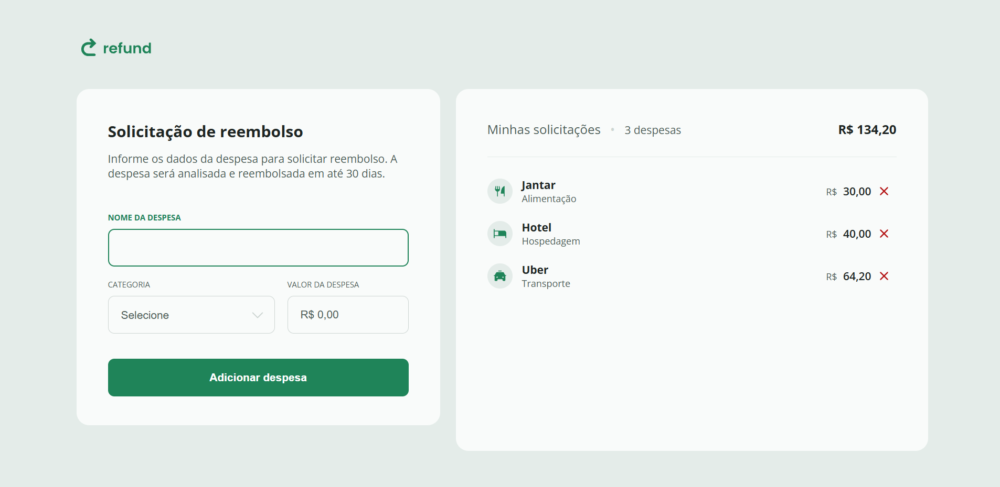

💸 Refund - Desafio Rocketseat
Este projeto foi desenvolvido como parte do Desafio Refund da Rocketseat, com o objetivo de praticar HTML, CSS e JavaScript na construção de uma interface funcional e responsiva de reembolso.

🧠 Sobre o Desafio
O desafio consistia em criar uma interface de reembolso (refund), onde o usuário insere dados como valor a ser reembolsado, método de reembolso e identificação da transação, e a interface apresenta um resumo da operação, com validações e uma experiência fluida.

✨ Funcionalidades

✅ Formulário para preenchimento dos dados do reembolso

✅ Validação dos campos obrigatórios

✅ Cálculo e exibição do valor total a ser reembolsado

✅ Feedback visual ao usuário

✅ Layout responsivo

✅ Interações com JavaScript puro (sem frameworks)

🛠️ Tecnologias

HTML5

CSS3

JavaScript (ES6+)

📷 Preview

📚 O que aprendi

Trabalhar com eventos de formulário

Manipular DOM com JavaScript

Criar validações básicas de entrada

Criar layout com design responsivo

📌 Status do projeto
✔️ Finalizado — melhorias futuras podem ser aplicadas com base no feedback.